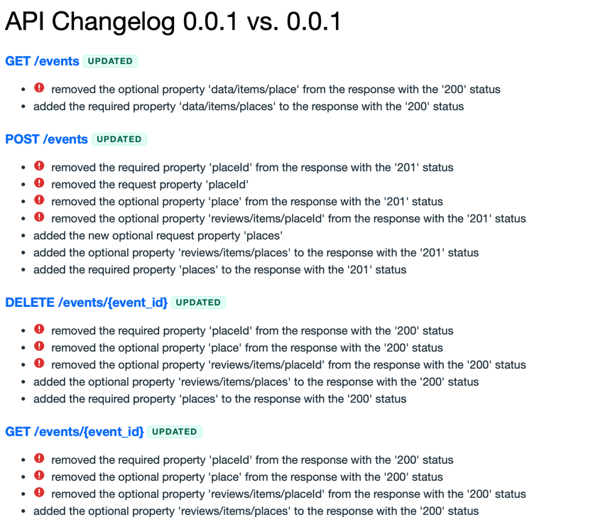

# apidrift - OpenAPI Diff Tool

[](https://github.com/sensiarion/apidrift/actions)
[](https://github.com/sensiarion/apidrift/releases)
[](LICENSE)

This tool is intended to help developers explore api changes in their application in most short and understandable way.

## Installation

### Quick Install (Linux/macOS)

```bash
curl -sSfL https://raw.githubusercontent.com/sensiarion/apidrift/main/install.sh | bash
```

Or with custom installation directory:

```bash
APIDRIFT_INSTALL_DIR=~/.local/bin curl -sSfL https://raw.githubusercontent.com/sensiarion/apidrift/main/install.sh | bash
```

### Install Specific Version

```bash
APIDRIFT_VERSION=v0.1.0 curl -sSfL https://raw.githubusercontent.com/sensiarion/apidrift/main/install.sh | bash
```

### Manual Installation

Download pre-built binaries from [Releases](https://github.com/sensiarion/apidrift/releases):

- **Linux (x86_64)**: `apidrift-linux-x86_64.tar.gz`
- **Linux (ARM64)**: `apidrift-linux-arm64.tar.gz`
- **macOS (Intel)**: `apidrift-macos-x86_64.tar.gz`
- **macOS (Apple Silicon)**: `apidrift-macos-arm64.tar.gz`
- **Windows (x86_64)**: `apidrift-windows-x86_64.zip`

Extract and move the binary to your PATH:

```bash
tar -xzf apidrift-*.tar.gz
sudo mv apidrift /usr/local/bin/
```

### Build from Source

```bash
git clone https://github.com/sensiarion/apidrift.git
cd apidrift
cargo build --release
sudo mv target/release/apidrift /usr/local/bin/
```

## Usage

```bash
apidrift <base_openapi.json> <current_openapi.json> [output.html]
```

The tool generates a comprehensive HTML report showing:
- Schema changes grouped by model
- Route changes
- Breaking changes highlighted
- Added/removed/modified endpoints

Both JSON and YAML OpenAPI specs are supported.

## For Developers

### Creating a Release

This project uses [cargo-dist](https://github.com/axodotdev/cargo-dist) for automated releases:

1. Update the version in `Cargo.toml`
2. Commit the changes:
   ```bash
   git commit -am "chore: bump version to X.Y.Z"
   git push
   ```
3. Create and push a git tag:
   ```bash
   git tag vX.Y.Z
   git push --tags
   ```
4. The release workflow will automatically:
   - Run all tests (build fails if tests fail)
   - Build binaries for all platforms (Linux x64/ARM64, macOS x64/ARM64, Windows x64)
   - Create installers (shell script for Unix, PowerShell for Windows)
   - Create a GitHub release with all artifacts

See [RELEASE.md](RELEASE.md) for detailed release instructions.

### CI/CD Workflows

- **CI Workflow** (`.github/workflows/ci.yml`): Runs on every PR and merge to main
  - Tests formatting with `cargo fmt`
  - Runs linting with `cargo clippy`
  - Builds the project
  - Runs all tests

- **Release Workflow** (`.github/workflows/release.yml`): Runs when a version tag is pushed
  - First runs all tests (must pass before building)
  - Builds release artifacts for all platforms using cargo-dist
  - Creates GitHub release with all artifacts and installers

## Why i want yet another one tool

I really love [oasdiff](https://github.com/oasdiff/oasdiff) and use it in my work projects. But we have some troubles
with it.

### It is too much noise information

See example https://html-preview.github.io/?url=https://github.com/oasdiff/oasdiff/blob/main/examples/changelog.html

It's displaying all quite well, but when a look at real example on my project, i can see following.



And about 5 screens of same change above.

### Endpoint oriented diff

My projects - mainly relay on fastapi, with highly reusable pydantic schemas. It leads to broadly changes on endpoints
with 1 line of code. To handle changes properly i need model oriented design, not routes. First of all we tracking model
changes and affecting routes, and than tracking changes on routes by itself.

I want to group changes by single model and not create 20 screen report only for single enum change.

### Resume

oasdiff - still amazing instrument, that i love to use, but I want more expressive tool to speedup changes tracking.

Yes, I can attempt to create custom theme to oasdiff and work with it, but it's not what i want. So we making this

## Target

I want to create diff tool, that:

- focuses on most expressive way to represent changes for humans
    - helps developers handle changes in types (changelog is mostly for frontend, which generates it's data types on
      openapi schema)
- blazingly fast (thx to rust)
- pre built binary for ci use
    - with simple install via curl/wget
- structured diff format (json)
- zero dependency pretty html format
    - with separated models changes and routes changes and grouping
- track changes by level, as oasdiff do (track breaking changes)
- accepts both yaml and json format


## TODO

- [x] verbose all fields for SchemaAddedRule
- [ ] deprecation tracking
- [ ] headers change tracking
- [x] add filter panel by level (critical, change, etc) to display only certain changes on report
  - [ ] also add CLI param to filter rules on generation
- [ ] track addition of required input param as Critical

- [ ] parallel comparison run
  - [ ] will require to build dep tree or locks, to prevent multiple parsing on recursive

- [ ] auth change/server params
- [ ] version change tracking
- [ ] headers tracking


## Inspired