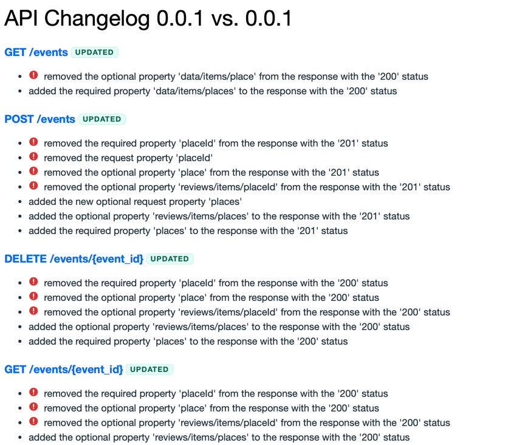

# apidrift - OpenAPI Diff Tool

* [1 Installation](#installation)
  * [1.1 Quick Install (Linux/macOS)](#quick-install-linuxmacos)
  * [1.2 Install Specific Version](#install-specific-version)
  * [1.3 Manual Installation](#manual-installation)
  * [1.4 Build from Source](#build-from-source)
* [2 Usage](#usage)
  * [2.1 Try it in 30 seconds (sample specs + hosted report)](#try-it-in-30-seconds-sample-specs--hosted-report)
  * [2.2 Browser playground (GitHub Pages)](#browser-playground-github-pages)
* [3 For Developers](#for-developers)
  * [3.1 Creating a Release](#creating-a-release)
  * [3.2 CI/CD Workflows](#cicd-workflows)
* [4 Why i want yet another one tool](#why-i-want-yet-another-one-tool)
  * [4.1 It is too much noise information](#it-is-too-much-noise-information)
  * [4.2 Endpoint oriented diff](#endpoint-oriented-diff)
  * [4.3 Resume](#resume)
* [5 Target](#target)
* [6 TODO](#todo)
  * [6.1 Future features](#future-features)


[](https://github.com/sensiarion/apidrift/actions)
[](https://github.com/sensiarion/apidrift/releases)
[](LICENSE)

This tool is intended to help developers explore api changes in their application in most short and understandable way.

## Installation

### Quick Install (Linux/macOS)

```bash
curl --proto '=https' --tlsv1.2 -LsSf https://github.com/sensiarion/apidrift/releases/latest/download/apidrift-installer.sh | sh
```

Example output (macOS Apple Silicon):

```text
downloading apidrift 0.1.4 aarch64-apple-darwin
installing to /Users/you/.cargo/bin
  apidrift
everything's installed!
```

Or with custom installation directory:

```bash
APIDRIFT_INSTALL_DIR="$HOME/.local" \
  curl --proto '=https' --tlsv1.2 -LsSf https://github.com/sensiarion/apidrift/releases/latest/download/apidrift-installer.sh | sh
```

### Install Specific Version

```bash
curl --proto '=https' --tlsv1.2 -LsSf https://github.com/sensiarion/apidrift/releases/download/v0.1.4/apidrift-installer.sh | sh
```

### Manual Installation

Download pre-built binaries from [Releases](https://github.com/sensiarion/apidrift/releases):

- **Linux (x86_64)**: `apidrift-x86_64-unknown-linux-gnu.tar.xz` (or `...-musl.tar.xz`)
- **Linux (ARM64)**: `apidrift-aarch64-unknown-linux-gnu.tar.xz` (or `...-musl.tar.xz`)
- **macOS (Intel)**: `apidrift-x86_64-apple-darwin.tar.xz`
- **macOS (Apple Silicon)**: `apidrift-aarch64-apple-darwin.tar.xz`
- **Windows (x86_64)**: `apidrift-x86_64-pc-windows-msvc.zip`

Extract and move the binary to your PATH:

```bash
tar xf apidrift-*.tar.xz
sudo mv apidrift /usr/local/bin/
```

### Build from Source

```bash
git clone https://github.com/sensiarion/apidrift.git
cd apidrift
cargo build --release
sudo mv target/release/apidrift /usr/local/bin/
```

## Usage

```bash
apidrift <base_openapi.{json,yaml}> <current_openapi.{json,yaml}> -o report.html
```

The tool generates a comprehensive HTML report showing:

- Schema changes grouped by model
- Route changes
- Breaking changes highlighted
- Added/removed/modified endpoints

Both JSON and YAML OpenAPI specs are supported.

### Try it in 30 seconds (sample specs + hosted report)

Generate the sample report locally:

```bash
./scripts/generate_sample_report.sh
open docs/reports/sample_report.html
```

Or view the sample report rendered from this
repository: [click to open example report](https://html-preview.github.io/?url=https://github.com/sensiarion/apidrift/blob/main/docs/reports/sample_report.html)


### Browser playground (GitHub Pages)

Paste two OpenAPI specs in the browser and get the same HTML report as the CLI. Diffing runs locally via WebAssembly (nothing is uploaded).

**Live site (after you enable Pages):** `https://sensiarion.github.io/apidrift/`.

Local preview (needs [wasm-pack](https://rustwasm.github.io/wasm-pack/installer/) and Rust with the `wasm32-unknown-unknown` target; use rustup if your system `cargo` has no wasm std):

```bash
cd wasm
wasm-pack build --target web --out-dir ../docs/playground/pkg --release --no-typescript --no-opt
```

Then serve `docs/playground` with any static file server and open the site (for example `npx --yes serve docs/playground`).

## For Developers

### Creating a Release

This project uses [cargo-dist](https://github.com/axodotdev/cargo-dist) for automated releases:

1. Update the version in `Cargo.toml`
2. Commit the changes:
   ```bash
   git commit -am "chore: bump version to X.Y.Z"
   git push
   ```
3. Create and push a git tag:
   ```bash
   git tag vX.Y.Z
   git push --tags
   ```
4. The release workflow will automatically:
    - Run all tests (build fails if tests fail)
    - Build binaries for all platforms (Linux x64/ARM64, macOS x64/ARM64, Windows x64)
    - Create installers (shell script for Unix, PowerShell for Windows)
    - Create a GitHub release with all artifacts

See [RELEASE.md](RELEASE.md) for detailed release instructions.

### CI/CD Workflows

- **CI Workflow** (`.github/workflows/ci.yml`): Runs on every PR and merge to main
    - Checks formatting with `cargo fmt`
    - Builds the project and runs a **wasm32** smoke build (`apidrift-wasm`)
    - Runs all tests  
    - (Clippy is wired in the toolchain but the step is currently commented out in the workflow file.)

- **Release Workflow** (`.github/workflows/release.yml`): Runs when a version tag is pushed
    - First runs all tests (must pass before building)
    - Builds release artifacts for all platforms using cargo-dist
    - Creates GitHub release with all artifacts and installers

## Why i want yet another one tool

I really love [oasdiff](https://github.com/oasdiff/oasdiff) and use it in my work projects. But we have some troubles
with it.

### It is too much noise information

See example https://html-preview.github.io/?url=https://github.com/oasdiff/oasdiff/blob/main/examples/changelog.html

It's displaying all quite well, but when a look at real example on my project, i can see following.



And about 5 screens of same change above.

### Endpoint oriented diff

My projects - mainly relay on fastapi, with highly reusable pydantic schemas. It leads to broadly changes on endpoints
with 1 line of code. To handle changes properly i need model oriented design, not routes. First of all we tracking model
changes and affecting routes, and than tracking changes on routes by itself.

I want to group changes by single model and not create 20 screen report only for single enum change.

### Resume

oasdiff - still amazing instrument, that i love to use, but I want more expressive tool to speedup changes tracking.

Yes, I can attempt to create custom theme to oasdiff and work with it, but it's not what i want. So we making this

## Target

I want to create diff tool, that:

- focuses on most expressive way to represent changes for humans
    - helps developers handle changes in types (changelog is mostly for frontend, which generates it's data types on
      openapi schema)
- blazingly fast (thx to rust)
- pre built binary for ci use
    - with simple install via curl/wget
- structured diff format (json)
- zero dependency pretty html format
    - with separated models changes and routes changes and grouping
- track changes by level, as oasdiff do (track breaking changes)
- accepts both yaml and json format

## TODO

- [ ] accept http url as source
- [ ] refactor readme (fast start + add displayable example (i saw htmlviewer for github files yearly))
- [ ] fix errors counting (do not calc same errors multiple times)
- [ ] show schema name for property changes in schema, not just `Single(array)`
- [ ] fix installation script into repo (scripts from releases works fine)
- [x] fix route checks (shows incorrect additiondist build/removal of params)
- [x] mark input/response schemas in routes more explicitly
- [x] verbose all fields for SchemaAddedRule
- [ ] deprecation tracking
- [ ] headers change tracking
- [x] add filter panel by level (critical, change, etc) to display only certain changes on report
    - [ ] also add CLI param to filter rules on generation
- [ ] track addition of required input param as Critical
- [ ] fix display types (now it shows like "Some()" and rest rust impl info)
- [ ] refactor display of add/remove params in schema. Color - for change level and +/- emoji for addition/removal
    - [ ] this also leads to refactoring of display removal properties. It should be included in rendering scheme

- [ ] parallel comparison run
    - [ ] will require to build dep tree or locks, to prevent multiple parsing on recursive

- [ ] auth change/server params
- [ ] version change tracking
- [ ] headers tracking

### Future features

- [ ] tracking of non schema body changes in routes.
    - This project is mainly suited for auto generated openapi specs with schemas

- [ ] others export formats (markdown, json)
    - markdown is mostly to pass those changes to llm

- [ ] filter affecting routes by tag (produce changes only for routes (and schemas related to those routes), that marked
  with specified tag)