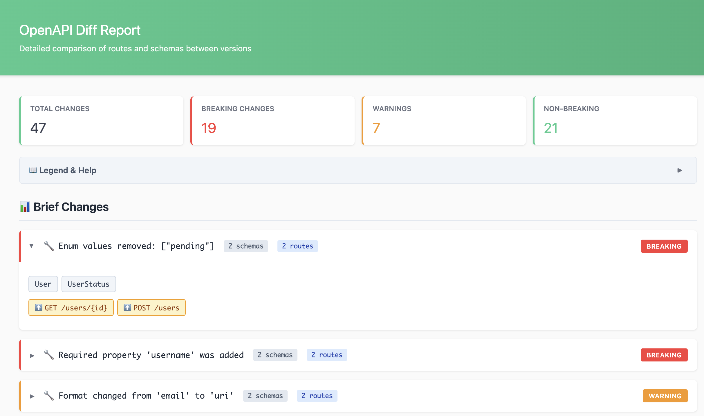

# apidrift

**Compare two OpenAPI specs. Get a clean, human-readable diff report.**

[](https://github.com/sensiarion/apidrift/actions)
[](https://github.com/sensiarion/apidrift/releases)
[](LICENSE)

```bash
# install
curl --proto '=https' --tlsv1.2 -LsSf https://github.com/sensiarion/apidrift/releases/latest/download/apidrift-installer.sh | sh

# run
apidrift base.yaml current.yaml -o report.html
```

apidrift groups schema changes by model instead of repeating them per-endpoint, so a single enum change produces one compact section — not 20 screens of duplicated noise.



> [View a live sample report](https://html-preview.github.io/?url=https://github.com/sensiarion/apidrift/blob/main/docs/reports/sample_report.html) or try the [browser playground](https://sensiarion.github.io/apidrift/) (runs entirely in WebAssembly, nothing uploaded).

---

## Installation

### Quick install (Linux / macOS)

```bash
curl --proto '=https' --tlsv1.2 -LsSf https://github.com/sensiarion/apidrift/releases/latest/download/apidrift-installer.sh | sh
```

To install to a custom directory:

```bash
APIDRIFT_INSTALL_DIR="$HOME/.local" \
  curl --proto '=https' --tlsv1.2 -LsSf https://github.com/sensiarion/apidrift/releases/latest/download/apidrift-installer.sh | sh
```

### Download a binary

Pre-built binaries for every major platform are attached to each [GitHub Release](https://github.com/sensiarion/apidrift/releases):

| Platform | Archive |
|----------|---------|
| Linux x86_64 | `apidrift-x86_64-unknown-linux-gnu.tar.xz` |
| Linux ARM64 | `apidrift-aarch64-unknown-linux-gnu.tar.xz` |
| macOS Intel | `apidrift-x86_64-apple-darwin.tar.xz` |
| macOS Apple Silicon | `apidrift-aarch64-apple-darwin.tar.xz` |
| Windows x86_64 | `apidrift-x86_64-pc-windows-msvc.zip` |

```bash
tar xf apidrift-*.tar.xz
sudo mv apidrift /usr/local/bin/
```

### Build from source

```bash
git clone https://github.com/sensiarion/apidrift.git
cd apidrift
cargo build --release
# binary is at target/release/apidrift
```

---

## Usage

```text
apidrift <BASE_SPEC> <CURRENT_SPEC> [OPTIONS]
```

| Option | Description |
|--------|-------------|
| `-o, --output <FILE>` | Output path (default: `apidrift_report.html`) |
| `--open` | Open the report in the default browser |
| `--chrome` | Prefer Chrome when opening (requires `--open`) |
| `--include-descriptions` | Include description-only schema changes |
| `-f, --format <FORMAT>` | Output format — `html` (default) |
| `-v, --verbose` | Verbose logging |
| `--vv` | Debug-level logging |

Both **JSON** and **YAML** OpenAPI 3.x specs are supported.

### Example

```bash
apidrift examples/openapi/base.yaml examples/openapi/current.yaml -o report.html --open
```

The generated report contains:

- Schema changes grouped by model — each affected route listed alongside
- Route-level changes (added / removed / modified endpoints)
- Breaking changes highlighted with severity levels (Breaking, Warning, Change)
- Filter panel to show/hide changes by severity

### Generate the sample report locally

```bash
./scripts/generate_sample_report.sh
open docs/reports/sample_report.html
```

---

## Browser playground

Paste two OpenAPI specs in the browser and get the same report — no install required.
Diffing runs locally via WebAssembly; nothing is uploaded.

**Live:** [sensiarion.github.io/apidrift](https://sensiarion.github.io/apidrift/)

To run it locally (needs [wasm-pack](https://rustwasm.github.io/wasm-pack/installer/)):

```bash
cd wasm
wasm-pack build --target web --out-dir ../docs/playground/pkg --release --no-typescript --no-opt
npx --yes serve ../docs/playground
```

---

## Why apidrift?

Existing tools like [oasdiff](https://github.com/oasdiff/oasdiff) work well, but when schemas are heavily reused across endpoints (common in FastAPI / Pydantic projects), a single field change produces pages of duplicated output — one entry per affected route.

apidrift takes a **model-first** approach: schema changes are grouped by model, and affected routes are listed alongside each model. This keeps reports compact and scannable, even for large APIs.

| | apidrift | typical endpoint-oriented tools |
|--|----------|-------------------------------|
| Schema change display | Once per model, with affected routes | Repeated per endpoint |
| Report size for shared models | Compact | Grows with endpoint count |
| Output | Self-contained HTML, filterable | Varies |
| Runtime | Native binary / WebAssembly | Varies |

---

## Contributing

Contributions are welcome. To get started:

```bash
git clone https://github.com/sensiarion/apidrift.git
cd apidrift
cargo test
```

CI runs `cargo fmt --check`, `cargo build`, wasm smoke build, and `cargo test` on every PR.

### Creating a release

1. Bump the version in `Cargo.toml`
2. Commit and push
3. Tag and push:

```bash
git tag vX.Y.Z
git push --tags
```

The release workflow builds binaries for all platforms and publishes a GitHub Release automatically via [cargo-dist](https://github.com/axodotdev/cargo-dist).

---

## License

[Apache-2.0](LICENSE)
